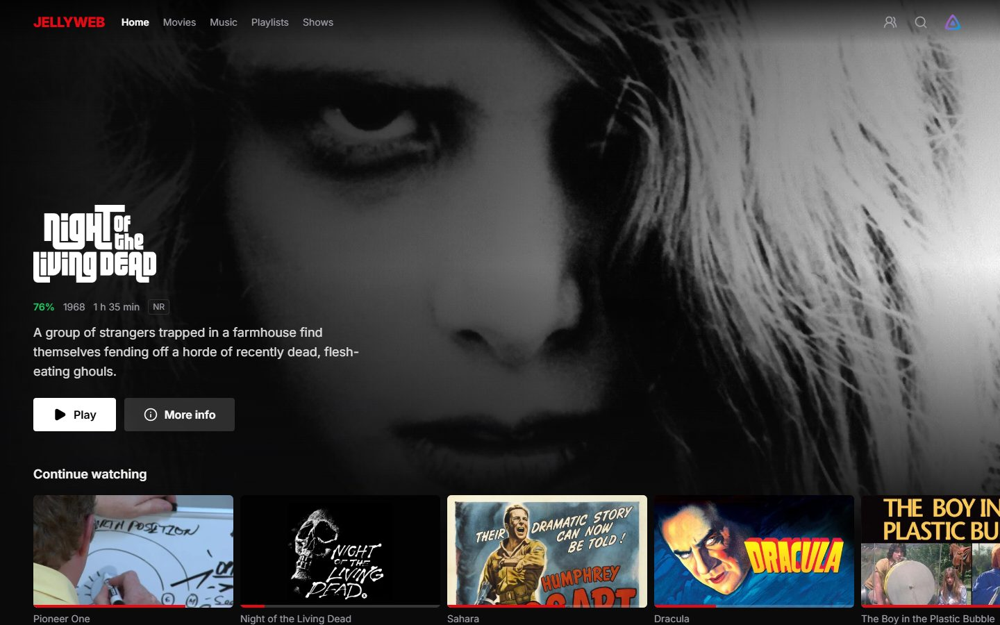
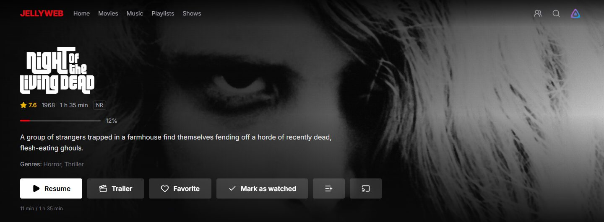
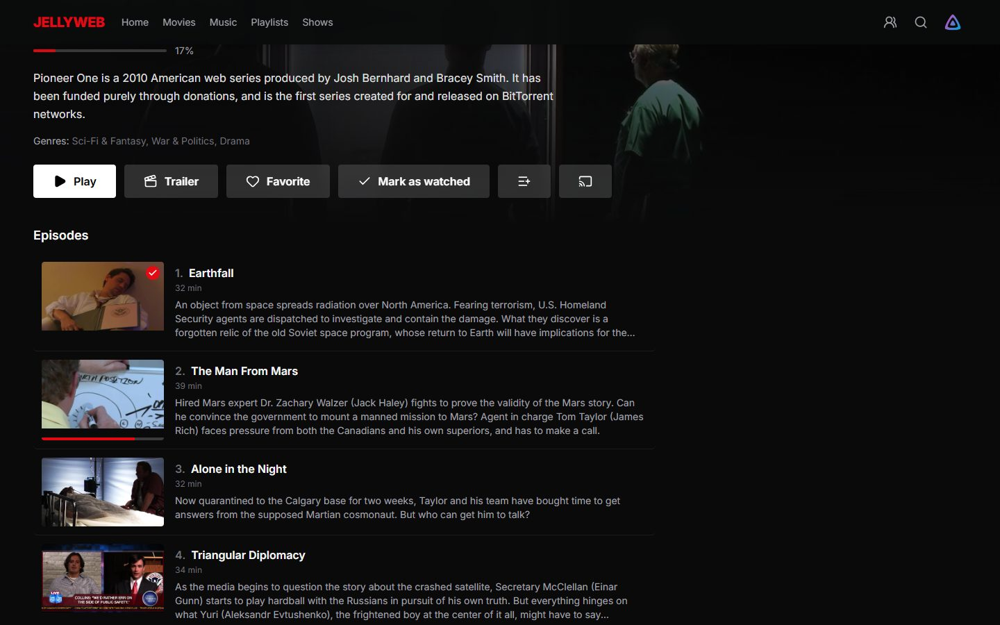
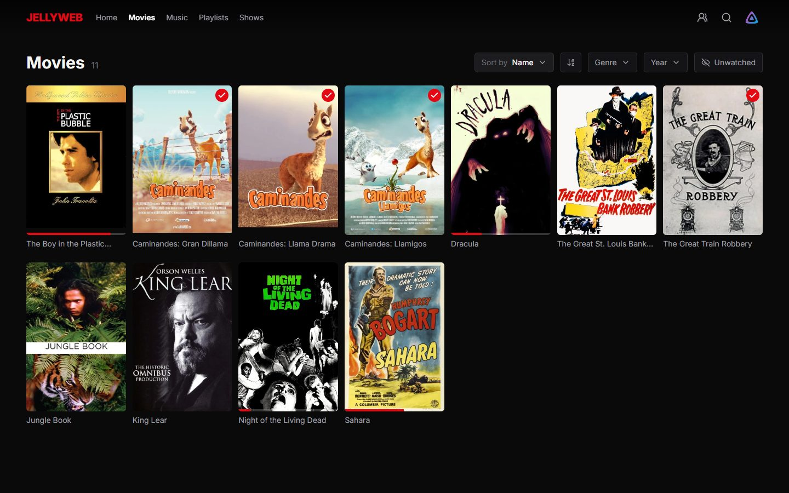
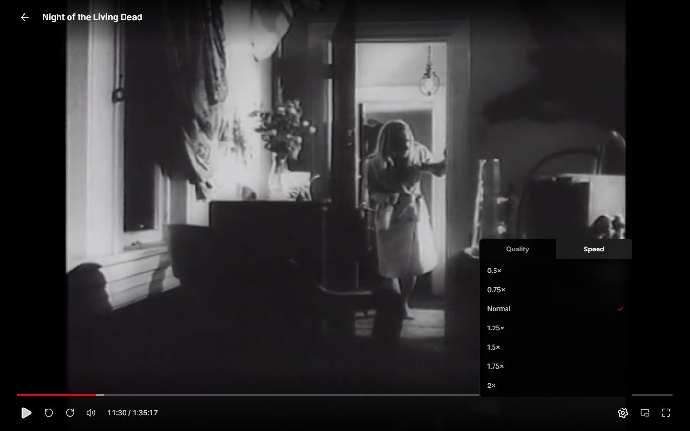
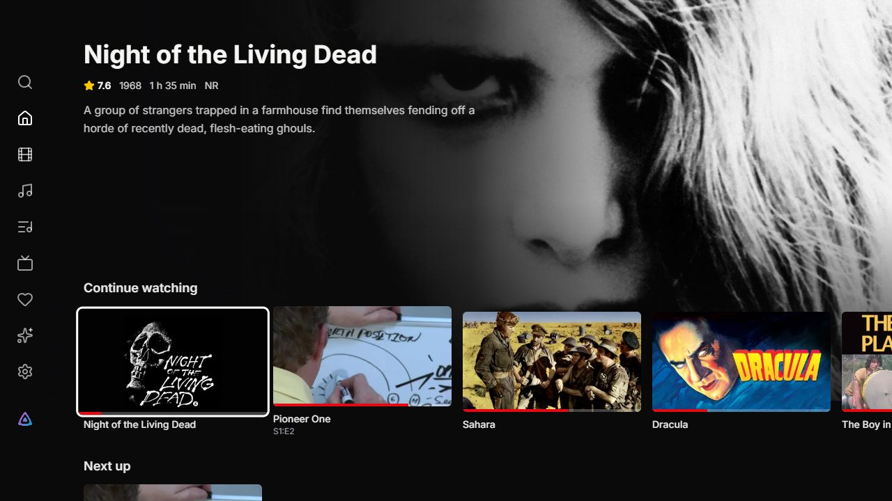
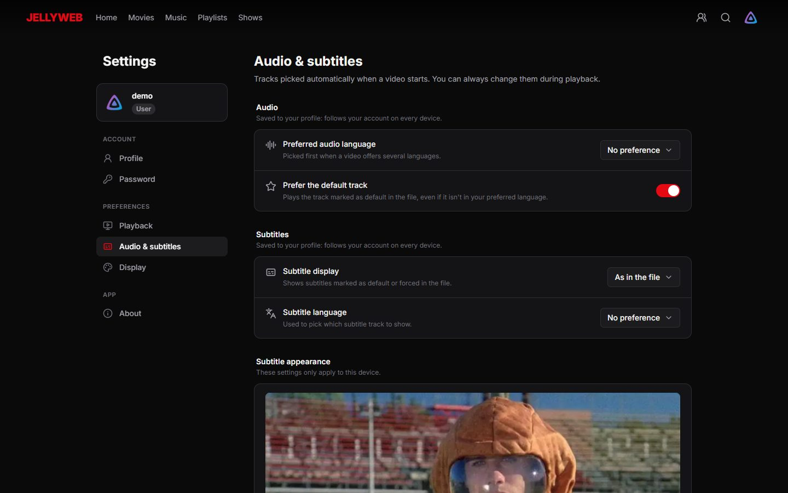
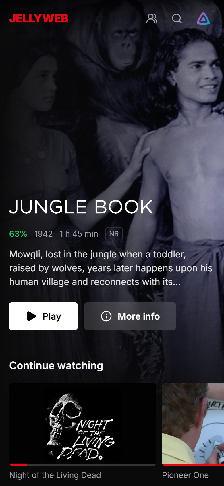
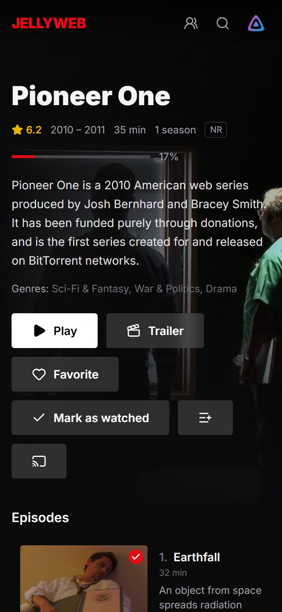
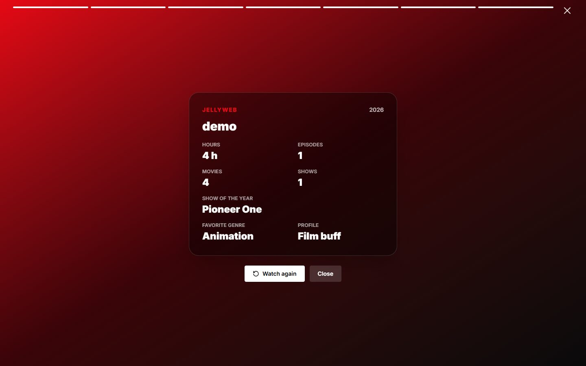

# JellyWeb

A client for [Jellyfin](https://jellyfin.org) that looks and feels closer to the streaming apps people already use at home. It runs in the browser, as a desktop app on Windows and Linux, and on Android phones, tablets and TVs.

JellyWeb only talks to your existing Jellyfin server. There is nothing to install on the server side and no account to create anywhere else.



This repository holds the releases (installers, APK and update feeds). The apps check it for updates.

## Download

Grab the files from the [latest release](https://github.com/jellyweb-app/releases/releases/latest).

| Platform                       | File                                           |
| ------------------------------ | ---------------------------------------------- |
| Windows                        | `JellyWeb_x.y.z_x64-setup.exe` (or the `.msi`) |
| Linux                          | `.deb`, `.rpm` or `.AppImage`                  |
| Android, Android TV, Google TV | `JellyWeb_x.y.z_android.apk`                   |
| Web browser                    | the Docker image below                         |

The desktop and Android apps update themselves. On Android, the first update asks for permission to install apps from JellyWeb. On some Google devices, Play Protect may flag the APK as coming from an unknown developer: tap **More details**, then **Install anyway**.

## Run the web version with Docker

The image is a small nginx server (amd64 and arm64) that serves the web app on port 8080. It runs as a non-root user and works with a read-only filesystem.

```bash
docker run -d --name jellyweb \
  -p 8080:8080 \
  -e JELLYWEB_SERVER_URL=http://192.168.1.10:8096 \
  --read-only --tmpfs /tmp \
  --restart unless-stopped \
  ghcr.io/jellyweb-app/jellyweb:latest
```

Or with Docker Compose:

```yaml
services:
  jellyweb:
    image: ghcr.io/jellyweb-app/jellyweb:latest
    container_name: jellyweb
    ports:
      - '8080:8080'
    environment:
      # Optional: Jellyfin server suggested on the login screen
      JELLYWEB_SERVER_URL: http://192.168.1.10:8096
    read_only: true
    tmpfs:
      - /tmp
    restart: unless-stopped
```

Then open `http://<your-machine>:8080`.

A few things worth knowing:

- It's the **browser** that connects to Jellyfin, not the container. `JELLYWEB_SERVER_URL` has to be an address your phones and computers can reach, not a Docker network name.
- If Jellyfin runs on the same machine, you can write `http://{host}:8096`: `{host}` is replaced by whatever address the page was opened with.
- The variable is only a suggestion. People can still type another server on the login screen.
- Tags: `latest`, `x.y.z` and `x.y` follow the releases.
- Plain HTTP works fine. Installing the site as an app from the browser needs HTTPS (a reverse proxy in front of the container, for example).

## What's in it

### Browsing

- Home screen with a large featured title, then rows for **Continue watching**, **Next up**, the latest additions of each library and **Because you watched…** suggestions.
- The featured image slowly pans between the backdrop and scenes from the show. A muted trailer can play in the background (off by default on TVs and on mobile data).
- Library pages with sorting, genre and year filters, and an "unwatched only" toggle.
- Search across movies, shows, episodes and people.
- Detail pages with ratings, progress, cast, similar titles, the trailer, and seasons with their episodes.
- Favorites, "mark as watched", add to a playlist or a collection.
- Music with albums, artists, a play queue and a mini player that follows you around the app.
- Photo viewer, book reader (EPUB, PDF, comics) and live TV with a program guide.

### Playback

- Plays the original file when the device can, otherwise asks Jellyfin to convert only what's needed (often just the container, without re-encoding).
- Audio and subtitle track selection, quality and playback speed.
- ASS/SSA subtitles keep their original styling. Size and style of regular subtitles are adjustable (outline, shadow or background box).
- For embedded subtitles, playback waits until the server has extracted them, so the first lines aren't missed. It also prepares them in advance when you open a detail page, and for the next episode while you watch.
- **Skip intro**, recap and credits, using Jellyfin's media segments or chapter names such as "OP" and "ED".
- Countdown to the next episode, with autoplay.
- Chapter marks and preview thumbnails on the progress bar (when the server generates them), picture-in-picture, full screen.
- Keyboard shortcuts: space or `k` to pause, arrows or `j`/`l` to seek, `f` for full screen, `m` to mute, `n` for the next episode, `0`–`9` to jump through the video.
- SyncPlay to watch together, and **Play on a device** to send what you're watching to another Jellyfin client.
- On Android, an optional native player (default on TVs) decodes 4K, HDR and 10-bit video in hardware and reads MKV files as they are, so switching audio or subtitle tracks is instant.

### Offline downloads

Available in the Windows, Linux and Android apps.

- Pick the quality each time: the original file, or a lighter 1080p, 720p or 480p version converted by the server.
- Download a whole season in one go.
- Watch without a connection. Your progress is sent back to Jellyfin as soon as the server is reachable again.

### Android TV

A separate interface built for the remote: a side menu, rows that scroll without jumping around, a preview of the focused title and big, readable focus states. The back button behaves like on other TV apps. Everything else (settings, music, admin) stays available.

### Profiles and settings

- **Who's watching?** Several Jellyfin accounts can be remembered on the same device. Switching doesn't ask for the password again.
- **Your year in review**: time spent watching, favorite show and genre, longest binge, busiest month, and a viewer profile. With the Playback Reporting plugin installed, administrators get exact watch time and rewatches.
- Settings are split between what belongs to the device (player, display, subtitle appearance) and what follows your account everywhere (preferred languages, subtitle mode).
- English and French.

### Administration

For admin accounts, a dashboard covering what's usually done in the Jellyfin web interface: activity and active sessions, users and their permissions (including parental ratings), libraries, transcoding and hardware acceleration, when playback position is saved, scheduled tasks, plugins, devices, API keys, logs and branding.

## More screenshots

|                                             |                                       |
| ------------------------------------------- | ------------------------------------- |
|         |   |
|          |      |
|  |  |

<p>
  
  
  
</p>

The screenshots were taken on Jellyfin's [public demo server](https://demo.jellyfin.org), which only hosts public domain and Creative Commons content.

## Compatibility

Tested with Jellyfin 10.11 and 12.x. JellyWeb is an independent project and isn't affiliated with the Jellyfin team.
